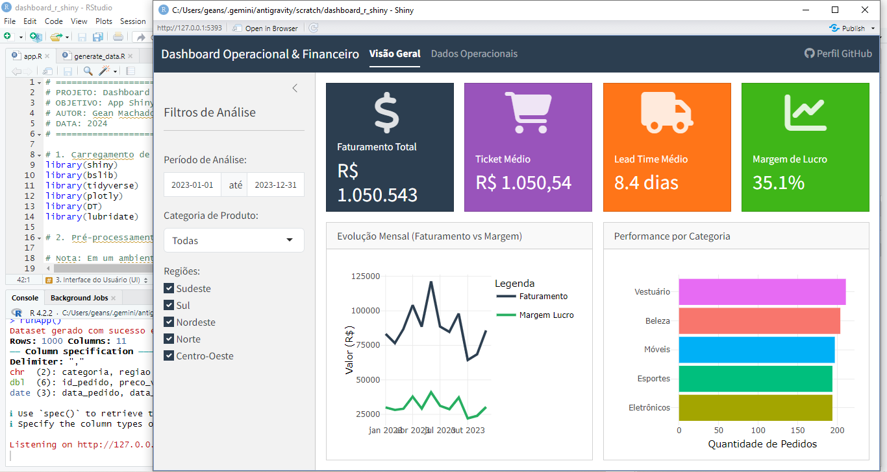
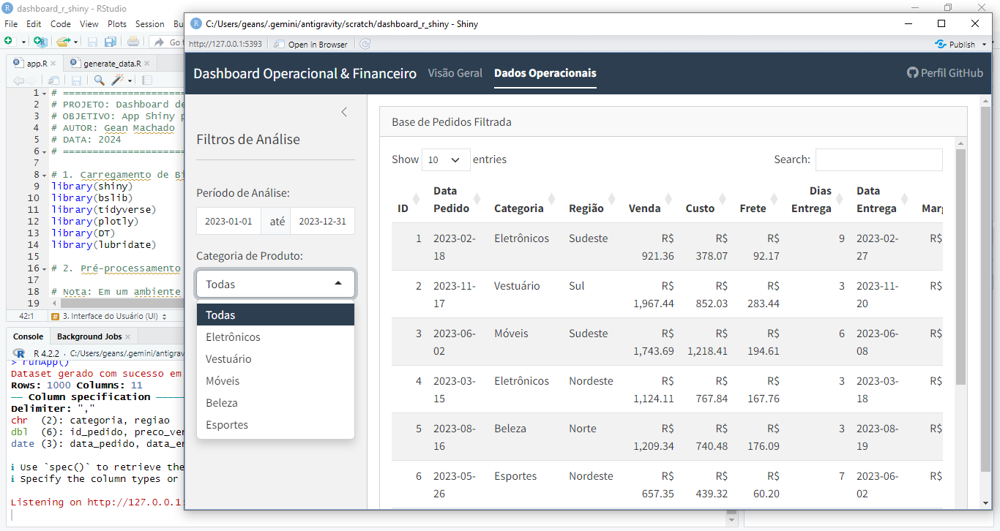

# Dashboard de Gestão Integrada: Indicadores Operacionais e Financeiros


## Visão Geral

Este projeto consiste em um dashboard interativo desenvolvido em **R** utilizando o framework **Shiny**. O objetivo principal é fornecer uma ferramenta de suporte à decisão para gestores, integrando fluxos operacionais e resultados financeiros de uma operação de varejo (e-commerce).

A interface foi projetada para permitir a exploração dinâmica de dados, identificando gargalos logísticos e oportunidades de otimização de margem.

### Demonstração do Painel

#### Visão Geral e Indicadores


#### Detalhamento de Dados Operacionais


## Indicadores Chave (KPIs)

O painel está estruturado em dois pilares fundamentais:

### 1. Indicadores Financeiros
*   **Faturamento Total (Gross Revenue):** Volume bruto de vendas no período.
*   **Ticket Médio:** Valor médio gasto por pedido, essencial para estratégias de upselling.
*   **Margem de Contribuição:** Análise simplificada da rentabilidade por categoria de produto.
*   **Custo de Frete:** Impacto logístico sobre a receita bruta.

### 2. Indicadores Operacionais
*   **Volume de Pedidos:** Demanda total processada.
*   **Lead Time Médio:** Tempo decorrido entre a aprovação do pedido e a entrega final.
*   **Performance por Categoria:** Distribuição de volume de vendas por segmento de mercado.
*   **Densidade Regional:** Mapeamento geográfico de pedidos.

## Tecnologias Utilizadas

*   **R 4.x**: Linguagem base para computação estatística.
*   **Shiny**: Framework para desenvolvimento de aplicações web reativas.
*   **Tidyverse (dplyr, ggplot2, tidyr)**: Manipulação e visualização de dados.
*   **bslib**: Design de interface moderna e responsiva (Bootstrap 5).
*   **DT/reactable**: Tabelas interativas de alto desempenho.
*   **Plotly**: Gráficos dinâmicos com interação hover.

## Documentação Acadêmica e Processos

### Metodologia de Tratamento de Dados
Os dados passam por um pipeline de limpeza (ETL) que garante:
1.  Consistência de tipos (datas, moedas).
2.  Tratamento de valores ausentes (NAs).
3.  Criação de variáveis calculadas (Margem, Dias de Entrega).

### Arquitetura do Código
O projeto segue o padrão de **Modularização do Shiny**, garantindo que o código seja escalável, fácil de testar e manter.

## Como Executar

1.  Certifique-se de ter o [R](https://www.r-project.org/) e o [RStudio](https://rstudio.com/) instalados.
2.  Clone este repositório:
    ```bash
    git clone https://github.com/geansm2/dashboard_r_shiny.git
    ```
3.  Abra o arquivo `app.R`.
4.  Instale as dependências necessárias:
    ```r
    install.packages(c("shiny", "tidyverse", "bslib", "plotly", "DT", "lubridate"))
    ```
5.  Execute o aplicativo clicando em 'Run App' no RStudio.

## Justificativa Acadêmica e Técnica

### Escolha do Framework
A opção pelo **Shiny (R)** justifica-se pela sua capacidade de integrar análise estatística rigorosa com interfaces dinâmicas, sem a necessidade de um backend complexo separado. Academicamente, isso permite a reprodutibilidade dos dados — um pilar da ciência de dados moderna.

### Design de Indicadores
A seleção de KPIs baseia-se no modelo **DuPont** de análise financeira (adaptado), onde buscamos entender como a eficiência operacional (Lead Time, Logística) impacta diretamente o retorno financeiro (Margem, Faturamento).

---
**Desenvolvido por [Gean]** - [GitHub](https://github.com/geansm2)
